# TaskFlow

A complete task and project workspace built with React, Vite, Tailwind CSS, FastAPI, SQLAlchemy, Alembic, and PostgreSQL. TaskFlow follows the supplied BRD v1.1: managers organize projects and review work, members execute assigned tasks, and administrators manage access.

The original [business requirements](docs/BRD.md) and [delivery validation record](docs/validation.md) are included for review.

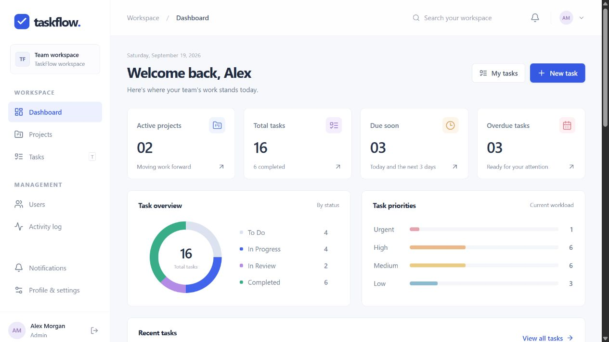

## Features

- JWT access tokens, rotating refresh tokens in HttpOnly cookies, logout revocation, profiles, and password changes.
- Admin-managed accounts, three roles, account activation, and protection for the last active administrator.
- Projects, automatic manager membership, team membership rules, date validation, archive and restore.
- Assigned or unassigned tasks, priorities, deadlines, review/approval/return/reopen workflow, and archive and restore.
- Comments with ownership checks, in-app notifications, and immutable activity history.
- Permission-scoped dashboards, search, filters, sorting, and bounded pagination.
- A responsive light interface with shared components, dialogs, skeletons, empty/error states, and toast feedback.
- Automated API tests, versioned migrations, Docker Compose, and a GitHub Actions workflow.

## Screenshots

| Login | Projects |
|---|---|
| 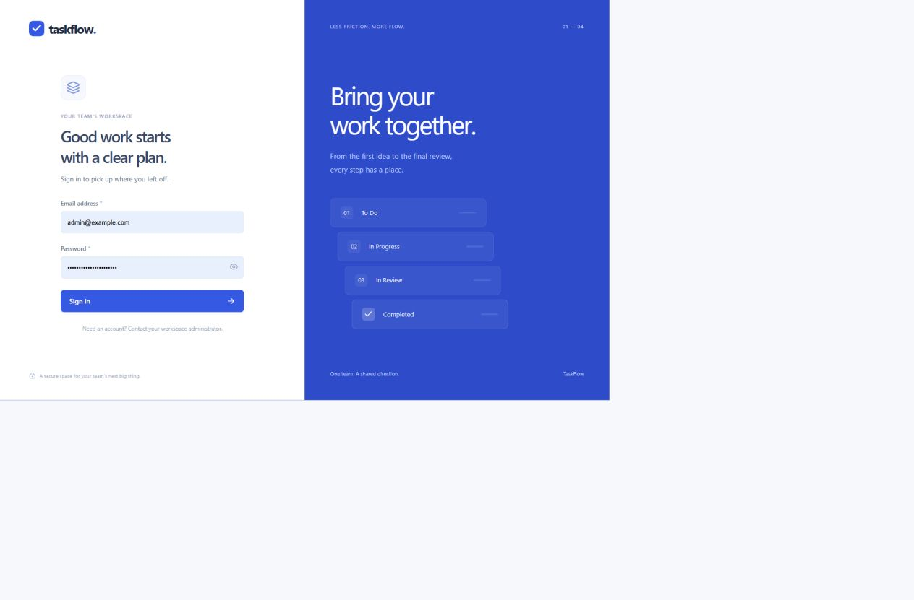 | 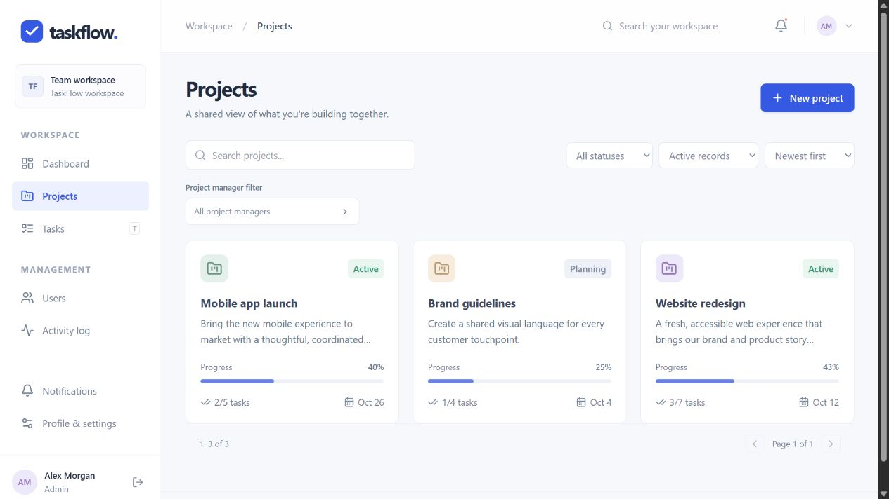 |

| Project details | Tasks |
|---|---|
| 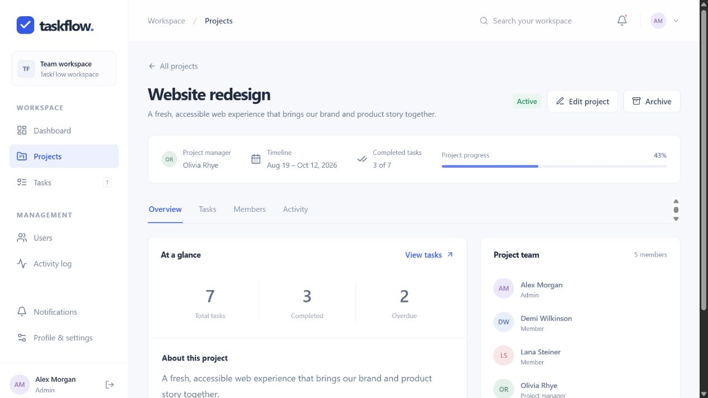 | 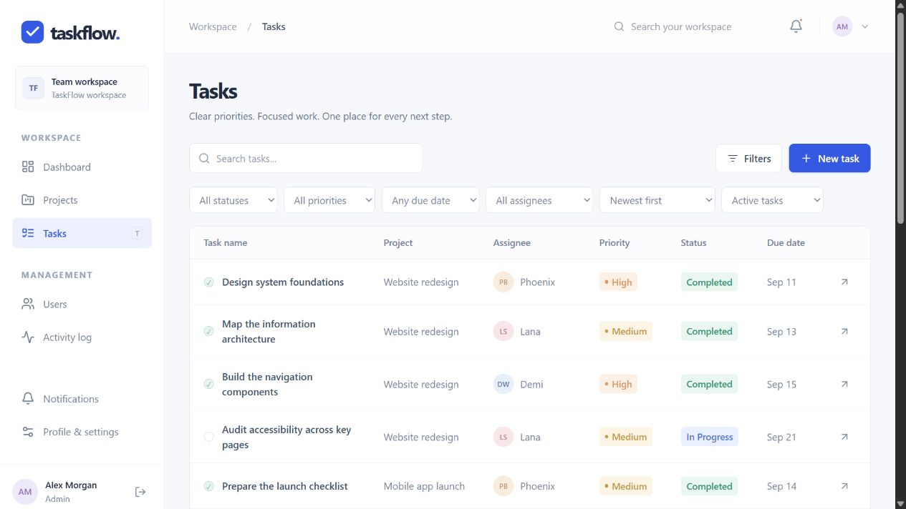 |

| Task discussion | User management |
|---|---|
| 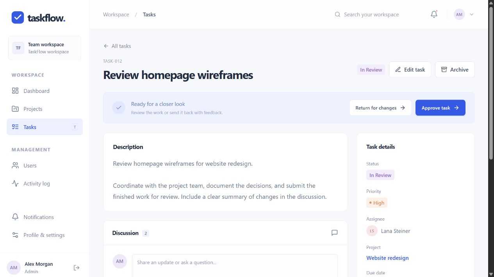 | 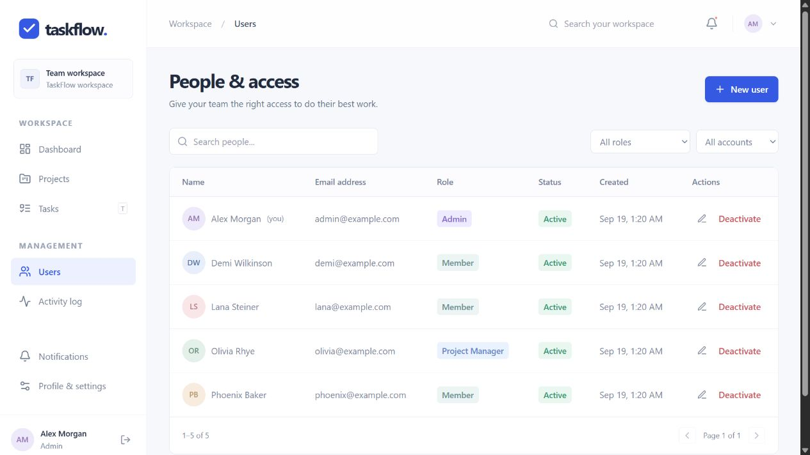 |

| Notifications | Mobile dashboard |
|---|---|
| 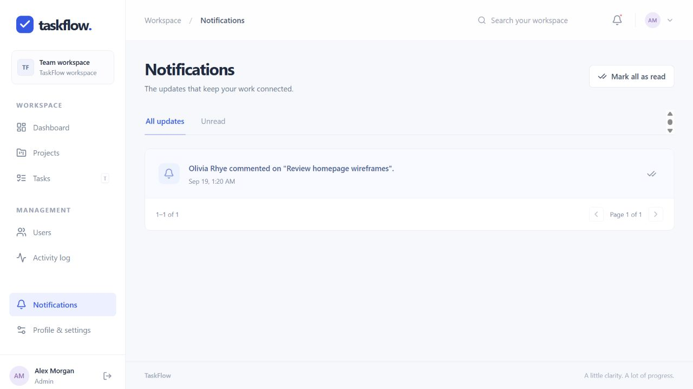 | 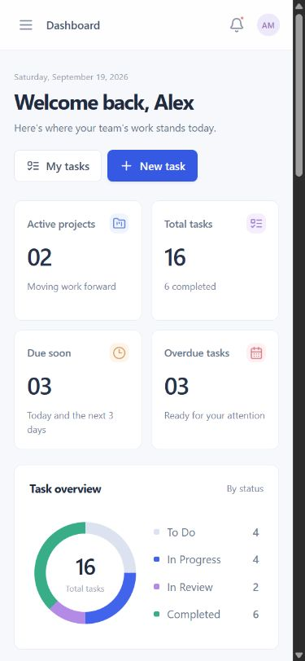 |

All screenshots use fictional sample data.

## Technology stack

| Layer | Technology |
|---|---|
| Interface | React 19, React Router, Vite 7, Tailwind CSS 4, Lucide React |
| API | Python 3.12, FastAPI, Pydantic |
| Persistence | PostgreSQL, SQLAlchemy 2, Alembic |
| Authentication | PyJWT, Argon2 via pwdlib, hashed refresh tokens |
| Tests | pytest, FastAPI TestClient |
| Containers | Docker Compose, PostgreSQL 17, Python, Nginx |

Exact tested package versions are recorded in `frontend/pnpm-lock.yaml` and `backend/requirements.lock.txt`.

## Architecture

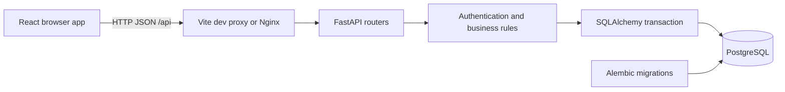

The browser holds the access token in memory. A SameSite=Strict HttpOnly cookie holds the refresh token. Refresh tokens are stored as SHA-256 hashes in the database. Every protected request checks the live account and session. Notifications, activity records, and business changes commit together.

## Database ERD

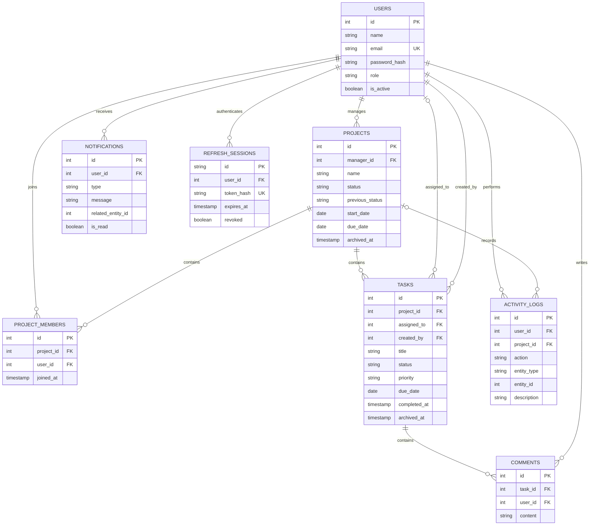

The schema also includes a singleton `system_locks` row used to serialize administrator changes. Membership has a unique `(project_id, user_id)` constraint. Business dates use SQL `DATE`; system timestamps use UTC. Additional implementation decisions are documented in [architecture.md](docs/architecture.md).

## Roles

| Role | Scope |
|---|---|
| Admin | All projects/tasks, accounts, moderation, and system activity |
| Project Manager | Manages assigned projects; can participate as a normal member in other joined projects |
| Member | Reads joined projects, changes assigned task status, comments, and manages their own profile |

Members cannot self-assign, approve, reopen completed work, or access user management. The API enforces permissions independently of the interface.

## Quick start with Docker

Prerequisites: Docker Engine/Desktop with Compose v2. Commands below run from the repository root.

1. Copy `.env.example` to `.env` (`cp` on macOS/Linux; `Copy-Item` on PowerShell).
2. Fill `POSTGRES_PASSWORD`, `JWT_SECRET`, `ADMIN_NAME`, `ADMIN_EMAIL`, and `ADMIN_PASSWORD`. Generate independent random values, for example:

   ```sh
   python -c "import secrets; print(secrets.token_hex(32))"
   ```

   Use a hex database password for the provided connection-URL interpolation. URL-encode reserved characters if using a different password format.

3. Build and start the services, then create the initial administrator:

   ```sh
   docker compose up --build -d --wait
   docker compose exec backend python seed_admin.py
   ```

4. Open [TaskFlow](http://localhost:8080) and sign in with the administrator values you configured.

The backend runs `alembic upgrade head` before startup. PostgreSQL waits until healthy before the backend starts. The database is persisted in the `postgres_data` named volume. `docker compose down` stops services without deleting that volume.

Optional sample data:

```sh
# Set DEMO_PASSWORD in the root .env first, then recreate the backend to load it.
docker compose up -d backend
docker compose exec backend python seed_demo.py
```

## Local development

Prerequisites: Python 3.12+, Node.js 22.12+ (or Node 24), pnpm 11.19, PostgreSQL 17 or 18.

### Database setup

Create a dedicated database and role using PostgreSQL tools or a database administrator. Alternatively, configure the root `.env` and start only the Compose database:

```sh
docker compose up -d db
```

Copy `backend/.env.example` to `backend/.env`. Set `DATABASE_URL` to your PostgreSQL database, set a random `JWT_SECRET`, and configure initial administrator details. Local frontend defaults use `http://localhost:5173`; if using `127.0.0.1`, add that exact origin to `CORS_ORIGINS` too.

### Backend startup

```sh
cd backend
python -m venv .venv
# macOS/Linux:
source .venv/bin/activate
# PowerShell instead:
# .\.venv\Scripts\Activate.ps1
python -m pip install -r requirements.lock.txt
python -m alembic upgrade head
python seed_admin.py
python -m uvicorn app.main:app --reload --host 127.0.0.1 --port 8000
```

Keep the backend running. No public registration is available. The seed command does nothing when an active administrator already exists and never prints credentials.

### Frontend startup

In another terminal:

```sh
cd frontend
npm install --global pnpm@11.19.0
pnpm install --frozen-lockfile
pnpm dev
```

Open [the development interface](http://localhost:5173). Vite proxies `/api` to `127.0.0.1:8000`.

```sh
pnpm build
pnpm preview --port 5173
```

`pnpm preview` serves the built interface. Keep the backend running. The config loader uses Vite's runner to avoid config-bundling path issues in restricted Windows environments. If dependency optimization is blocked by a Windows sandbox, use the production preview after a successful build.

## Environment variables

| Variable | Purpose / default |
|---|---|
| `DATABASE_URL` | SQLAlchemy PostgreSQL URL; required for your database |
| `JWT_SECRET` | Required random secret, at least 32 characters; no shipped default |
| `ACCESS_TOKEN_EXPIRE_MINUTES` | 30 |
| `REFRESH_TOKEN_EXPIRE_DAYS` | 7; absolute session expiry, rotation does not extend it |
| `CORS_ORIGINS` | Comma-separated exact browser origins |
| `COOKIE_SECURE` | `false` for local HTTP; `true` for deployed HTTPS |
| `BUSINESS_TIMEZONE` | IANA timezone used for overdue/due-soon dates; default `UTC` |
| `ADMIN_NAME`, `ADMIN_EMAIL`, `ADMIN_PASSWORD` | Initial seed administrator; password at least 8 characters |
| `DEMO_PASSWORD` | Optional development accounts; at least 8 characters |
| `POSTGRES_USER`, `POSTGRES_DB`, `POSTGRES_PASSWORD` | Compose database settings |
| `TEST_DATABASE_URL` | Optional disposable PostgreSQL database used by pytest |

Actual `.env` files are ignored by Git and Docker. Do not publish them. The API never returns password hashes or refresh tokens in JSON.

## Tests

From `backend` with the virtual environment active:

```sh
pytest -q
```

The default test fixture uses an isolated in-memory SQLite database. The PostgreSQL concurrency test is skipped in that mode. To run the entire suite against PostgreSQL, set `TEST_DATABASE_URL` to a **dedicated disposable test database**, then run `pytest -q` again. The fixture drops and recreates application tables in that test database for each test; never use an application or production database.

Migration checks, also on a disposable database:

```sh
alembic upgrade head
alembic check
alembic downgrade base
alembic upgrade head
```

The GitHub Actions workflow runs PostgreSQL API tests, migration checks, the frontend production build, and a Docker Compose smoke test. See [validation.md](docs/validation.md) for the checks actually executed during this delivery and remaining environmental limitations.

## API documentation

- [Interactive Swagger UI](http://localhost:8000/docs)
- [ReDoc](http://localhost:8000/redoc)
- [OpenAPI JSON](http://localhost:8000/openapi.json)
- [Endpoint guide and examples](docs/api.md)
- [Saved OpenAPI schema](docs/openapi.json)

All application endpoints use the `/api` prefix. Send `Authorization: Bearer <access_token>` for protected requests. Login accepts a JSON email/password body. Refresh/logout use the HttpOnly cookie. Collection responses contain `items`, `total`, `page`, and `page_size`.

## Demo accounts

Run `seed_admin.py` followed by `seed_demo.py` to create sample accounts and three sample projects. Passwords are never hardcoded:

| Role | Email | Password source |
|---|---|---|
| Admin | Your `ADMIN_EMAIL` | `ADMIN_PASSWORD` |
| Project Manager | `olivia@example.com` | `DEMO_PASSWORD` |
| Member | `phoenix@example.com` | `DEMO_PASSWORD` |
| Member | `lana@example.com` | `DEMO_PASSWORD` |
| Member | `demi@example.com` | `DEMO_PASSWORD` |

The local delivery preview has separate generated credentials in the adjacent `LOCAL-DEMO.md` file. That file and the running preview database are not part of the source archive.

## Repository structure

```text
taskflow/
  backend/
    app/
      config.py         Environment settings
      database.py       Engine and transaction dependency
      models.py         SQLAlchemy entities
      schemas.py        Validated request models
      security.py       Passwords, tokens, sessions, authentication
      common.py         Authorization, serialization, shared rules
      routers/          Auth, users, projects, tasks, collaboration, dashboard
    migrations/         Alembic schema history
    tests/              Business-rule and API tests
    seed_admin.py       Environment-driven administrator setup
    seed_demo.py        Optional fictional sample data
  frontend/
    src/
      api.js            HTTP client and session refresh
      context.jsx       Authentication, mutations, resource loading, toasts
      components/       Layout, forms, dialogs, tables, UI primitives
      pages/            Routed application screens
      styles.css        Shared light design system and responsive rules
  docs/                 API, architecture, validation, screenshots
  .github/workflows/    Automated checks
  compose.yaml          Frontend, backend, PostgreSQL
```

## Deployment

Deploy behind HTTPS with `COOKIE_SECURE=true`, exact trusted origins, durable PostgreSQL storage, and secrets provided by your hosting environment. Serve the frontend and API through the same origin so the Strict refresh cookie works reliably. Run migrations before accepting traffic and seed the first administrator once. Configure database backups and login rate limiting at the reverse proxy before exposing the portfolio demo publicly.

No public deployment or GitHub push is included in this local delivery. The application is ready to configure for a chosen host. Docker execution has a smoke job configured in CI, but that job has not run remotely and containers were not executed locally because Docker is not installed.

## Future improvements

Potential later versions could add file attachments, calendar integration, scheduled reminders, subtasks, and task dependencies. These are deliberately outside the approved version-one scope. Operational improvements could include database-backed login throttling, structured monitoring, and a larger automated frontend regression suite.
