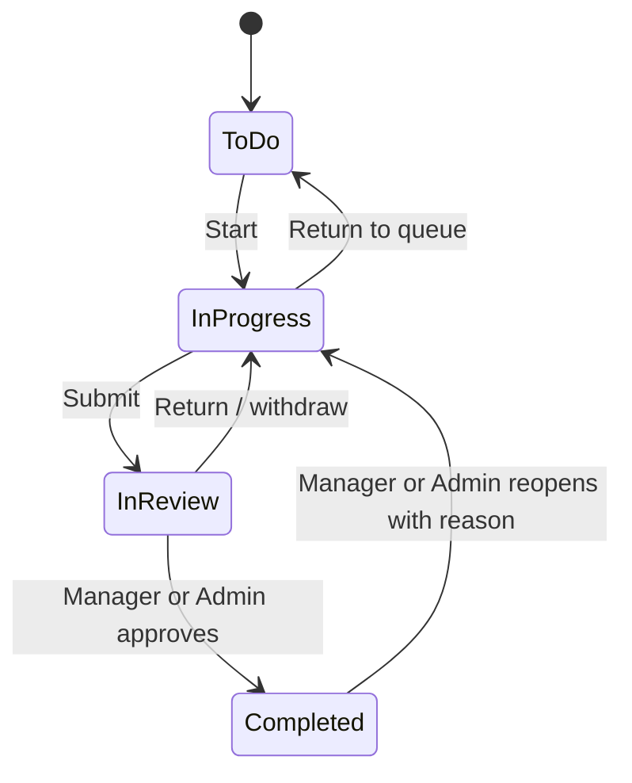

# Architecture and business decisions

## Boundaries

The application is one React SPA and one synchronous FastAPI service. There are no background schedulers, email services, AI features, public registration, uploads, dark mode, or organization layer. Requests use a single SQLAlchemy session/transaction; failures roll back all associated state, notifications, and activity entries.

## Permissions

`current_user` verifies a signed, unexpired access JWT, its persisted session, and the current account on every request. Roles are read from the database, not trusted from JWT claims. Project access checks are used in detail endpoints, collection queries, task comments, search, and dashboard aggregates.

Admins can access all resources. A Project Manager can manage projects whose `manager_id` matches their ID. A Project Manager who is only a member of another project has normal member permissions there. This allows the BRD's former manager to remain a normal member after replacement. Only admins can moderate someone else's comments. Members cannot see activity logs.

Out-of-scope project/task IDs return 404 to avoid leaking their existence. A user who can read a project but lacks management permission receives 403 for restricted writes. Read-only/archive conflicts use 409. Invalid data or workflow transitions use 422.

## Authentication

- Argon2 password hashes via `pwdlib`; missing users still incur a password verification to reduce username timing differences.
- HS256 access JWTs expire after 30 minutes and contain a user ID, session ID, token type, issue time, and expiry.
- Refresh tokens are random opaque values, valid for 7 days. Only SHA-256 hashes are stored.
- Refresh rotates the hash while holding a row lock. Previously used, expired, and revoked refresh tokens are rejected. The original absolute session expiry is preserved.
- Refresh cookies use HttpOnly, SameSite=Strict, `/api/auth`, and the configured Secure flag. Cross-origin cookie mutations reject untrusted Origin headers.
- Access tokens stay in browser memory. Refresh cookies restore sessions after reload.
- Logout revokes the refresh session and thereby also invalidates its access tokens. Password changes revoke all sessions. Deactivation and role changes revoke that user's sessions.
- Refresh rotation is coordinated within one browser tab. Multiple tabs can occasionally race and one may need to sign in again; cross-tab coordination is a future operational improvement.

## Concurrency and integrity

Mutations lock their parent project in PostgreSQL. This serializes project archiving with task/comment/member writes and project date changes with task dates. Administrator edits serialize on a singleton lock row, preventing concurrent edits from removing the final active administrator. These locks are meaningful on PostgreSQL; SQLite is used only as a fast test fallback.

Foreign keys protect entity relationships; unique constraints protect email addresses, membership, and refresh hashes. Database check constraints cover role/status/priority enums and project date ordering. Cross-entity rules (active assignee membership, task dates within project dates) are validated within the locked transaction.

The migration is self-contained and uses SQL types rather than importing mutable ORM models. New schema changes should use new Alembic revisions.

## Project rules

Project managers must be active accounts with Admin or Project Manager roles. An Admin may manage a project themselves or select an active manager. A replacement manager automatically joins the project; the old manager retains membership until explicitly removed. Users managing projects must be reassigned before their role can become Member. Account deactivation retains all assigned work and project history.

A project member cannot be removed while any unfinished task remains assigned to them, including archived unfinished tasks. Restore and reassign those first. Completed task history remains intact after removal.

Project date changes must keep all stored task dates in range, including archived tasks. Project archival preserves the previous operational status. Restoring does not independently change child task statuses or archived flags.

## Task workflow

Members may only use the first four transitions on tasks assigned to them. Managers/Admins may approve and reopen. Reopening clears `completed_at` and records the reason. A Member never approves a task, including their own. Admin/manager self-approval is not separately prohibited by the BRD.

An archived project blocks project edits, member changes, all task mutations, and comment create/edit/delete. An archived task blocks task edits, status changes, and comment mutations until restored. Task restoration is itself blocked when the parent project is archived.

## Calculations

Business dates are evaluated using `BUSINESS_TIMEZONE`, default UTC. The API returns `business_date` and `business_timezone` in dashboard responses. Date-only fields are rendered without timezone conversion; UTC timestamps are displayed in browser local time.

- Overdue: due date before today, incomplete, and task not archived.
- Due soon: today through today + 3 calendar days inclusive, incomplete, and task not archived.
- Progress: completed unarchived tasks / all unarchived tasks, rounded to a whole percentage; zero when there are no tasks.
- Tasks inside archived projects retain their calculated properties according to the BRD's task-level archive rule. An archived project remains viewable through the archive filter. Active-project KPI counts projects whose status is Active.
- Member dashboard task metrics concern their assigned tasks. Managers/Admins see metrics for tasks in their authorized scope. Project progress always represents the whole authorized project.

## Notifications and logs

Assignment notifies the new assignee. Reassignment notifies previous and new assignees. Review notifies the project manager. Approval/return notify the assignee. Comments notify manager and assignee, with deduplication and exclusion of the author. No scheduled reminders exist.

Notifications are private to their recipient; historical notifications remain after membership changes, but opening a related resource still checks current permissions. Logs record project/member/task changes and comment moderation without storing passwords or tokens. No API edits or deletes activity history.

## Query and UI design

Collections are paginated (default 20, maximum 100) and use a deterministic ID tie-breaker. Related scalar objects are joined to avoid per-row user/project queries. Project statistics use grouped queries for only the current project page. Dashboard aggregates are computed in SQL and recent item lists are bounded.

Remote project/user pickers search and paginate rather than loading every account. The frontend shares forms, badges, tables, dialogs, loading/error states, and one CSS design system. Native dialogs handle focus containment and Escape. Tables scroll within their containers on small screens; the sidebar becomes a drawer.

## Reference documentation

The implementation uses the security patterns described in [FastAPI's JWT/password hashing guide](https://fastapi.tiangolo.com/tutorial/security/oauth2-jwt/) and SQLAlchemy's transaction guidance in [Session Basics](https://docs.sqlalchemy.org/en/20/orm/session_basics.html).
